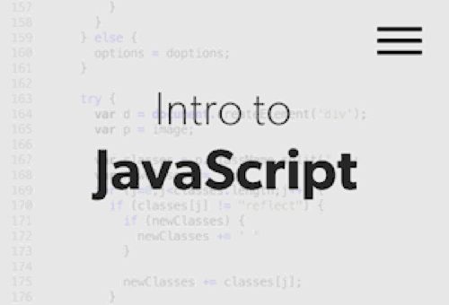

As I began my journey to learning JavaScript, I imagine that the language would be very similar to Java. Although the syntax is a bit different, I would say my hypothesis was correct! Right off the bat, I would say that anyone with a bit of experience in Java and C would recognize how much simpler the syntax is in JavaScript than compared to those languages. Which is why I zoomed through each stimulation in freeCodeCamp, from recognizing the similarities in syntax in Java and C, except in a more condensed form. As I continue using the language more, I can see JavaScript programing its way to the top of my list. 

In other words, for beginners, I would highly recommend learning JavaScript as an introductory programming language because of the simplicity of the language. Therefore, from a software engineering perspective, I would consider JavaScript to be considered "Heaven on Earth", at least compared to C. JavaScript would allow the software engineer at hand to concentrate on computing an answer; whereas in C, the language forces you to have a detailed knowledge of the computer's memory system and how the language might implement the program.

Evidently, there are long going arguments on which languages are better. In the long run, it's not the language that makes the programmer but the practice that goes into it. Therefore, I highly recommend anyone seeking to improve their performance and skills to try out Athletic Software Engineering.  ASE is not helps you enhances your software development skills, it will also allow you to be comfortable with any real-life stressful scenarios. For myself, I think that ASE would be highly motivating in developing my skills by competing against the clock and practicing more outside the classroom.

