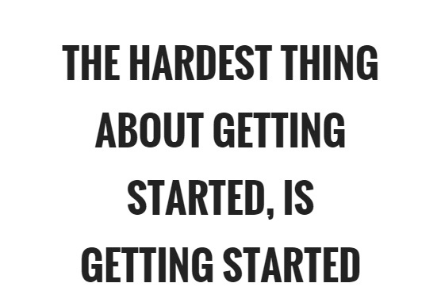
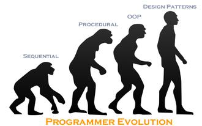

As we have all now realized, completing a project is the simplest part since you are just adding the finishing touches. So, when does the struggle begin? The beginning of course! Whether its building a website or starting on an artistic master piece, the most difficult and time-consuming part of the whole process is literally deciding where to begin! Luckily, we can just google a cookie cutter to solve problems for literally anything and everything.

The cookie cutter that helped me pass my ICS classes are examples codes. Through learning new languages and 100 different assignments, a special place in my heart has grown for example codes. These examples are the starting codes I use to reference to help me build and complete my assignments faster. Apparently, they are also referred to as a Design Pattern.

A design pattern is the reusable solution to commonly occurring problems. Or it can be thought of as the template that can be used in many different situations. 
After watching a 40-minute video on Design Patterns, I realized that everything around me such as buildings, tables, even food all have a design pattern to them. A good example of this is starting an art project of drawing a rose. When people dive right into it, they find themselves on a journey of erasing and redrawing and erasing, not knowing how to structure the rose. In my experience, after I finally googled “How to draw a rose”, I found a step to step outline and it changed the ways I draw my flowers since.

Overall, design patterns can be seen as a root of creation that can become revamp to something extraordinary. It can also be the one solution structure that can solve the 99 problems you may have.

   
