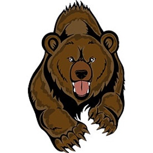
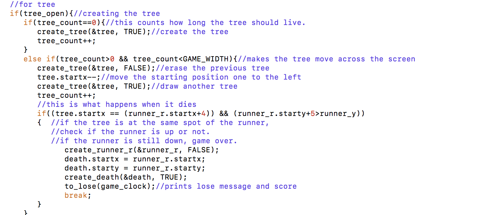

##Run Bear Run!

  

EE 160 was the first course to introduce me to my first programming language. Since I had no prior exposure to coding, I struggled a lot throughout the course. Although, through many trial and errors and endless semicolons, I was fascinated that I had the ability to create and develop programs that actually do something! So, for the final project of the class, we were given the task to design and implement a playable game in C. My team decided to build an "endless runner" game with obstacles to avoid by either ducking or jumping. 

My role was to help create the obstacles to avoid in the game and help design of the main character. To make the game challenging, I decided to have obstacles of various heights, a pit that the character can fall into, and an object that the character must duck under. To make the game even more entertaining, we decided to make the game appear animated, with the character running, a background object moving by to give the illusion of movement, and a new image when the character falls into a pit or hits an object. The game is called "Run Bear Run" and is entirely keyboard-driven using the SSH terminal. 

Working on this project took a lot of time outside of class. It was difficult to find times where our schedule did not clash with one another. One important key I learned from working in groups is communication. There were times numerous amount of times where one person's code was not compactable with another person's code, causing frustrations that could start a war. Another thing I also learned about working on projects with other people is that time management is extremely important. We relied on one another to have finished their portion of the work so that we can make progressions to develop our game before the deadline. Lastly, it was a great experience working on this project because my classmates were always helpful to explain to me concepts I did not understand.

## To show you a sample of code of an obstacle

