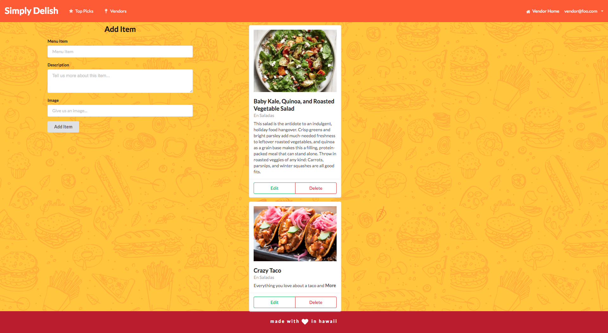
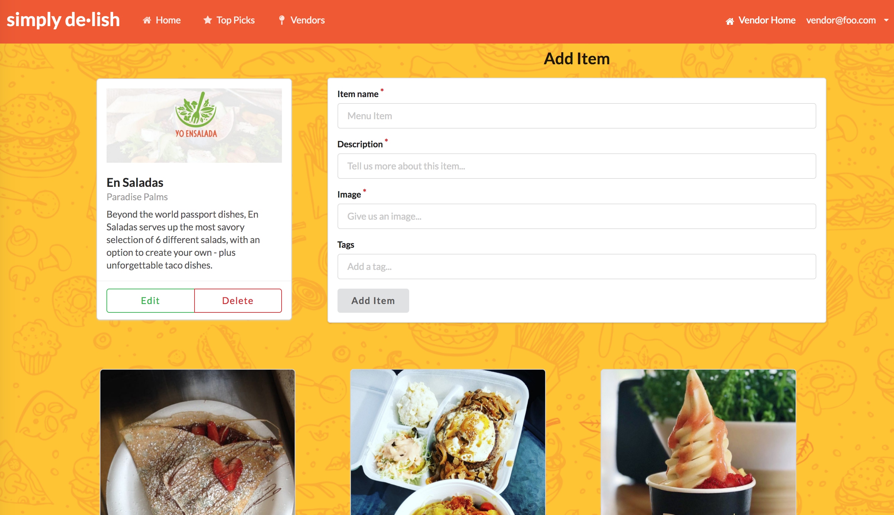

  

Simply Delish is an application available to UH Manoa students to allow them to search through all the delicious meals available to them across campus. The application also includes a feature for students to view the most beloved meals of the day, sorted by the ratings of likes of other fellow peers. Not only does Simply Delish cater to students, it also provides vendors to apply and mange the menu items they have available, as well as providing descriptions about their food items.

The team for this project was the total size of four people. My contribution to this project was helping and ensuring the flow and functionality of the web page. Most of my work went into the design and back-ground implementation as seen in the Vendor Home-page. I also assist in the background implementation.

From this project, it enhanced my ability of debugging and designing. I had a lot of practice with on how-to layout the webpage using Semantic UI React, specifically cards and grids. This project also deepened my understanding on implementation of storing things in the data base. Overall, I overcame a lot of obstacles while doing this project and learned how to communicate with my teammates whenever I come across a situation.

----

# To show you a sample of the Vendor HomePage design in progress

# The final result of the Vendor Homepage

